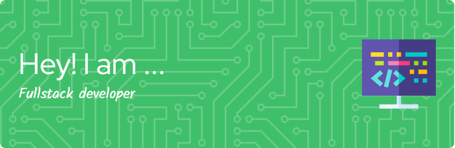

## Hi there 👋

<!--
**Johnny12p/Johnny12p** is a ✨ _special_ ✨ repository because its `README.md` (this file) appears on your GitHub profile.

Here are some ideas to get you started:

- 🔭 I’m currently working on ...
- 🌱 I’m currently learning ...
- 👯 I’m looking to collaborate on ...
- 🤔 I’m looking for help with ...
- 💬 Ask me about ...
- 📫 How to reach me: ...
- 😄 Pronouns: ...
- ⚡ Fun fact: ...
-->

## Sobre mí
Soy un apasionado de las computadoras y la programación. Me entusiasmo explorando nuevas tecnologías, aprendiendo continuamente y resolviendo problemas complejos a través del código.
## Tecnologías y herramientas
- **Lenguajes**: Python, PHP, Java, JavaScript, TypeScript, C#
- **Frameworks**: Django, Laravel, Vue.js
## Proyectos destacados
_(Próximamente)_
## Contacto
✉️ clarocaballero455@gmail.com
    |